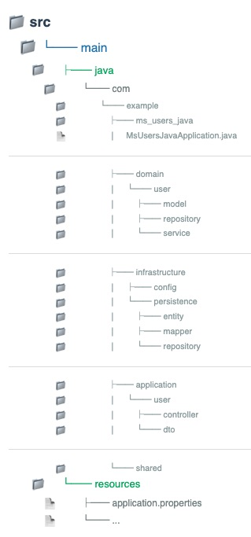
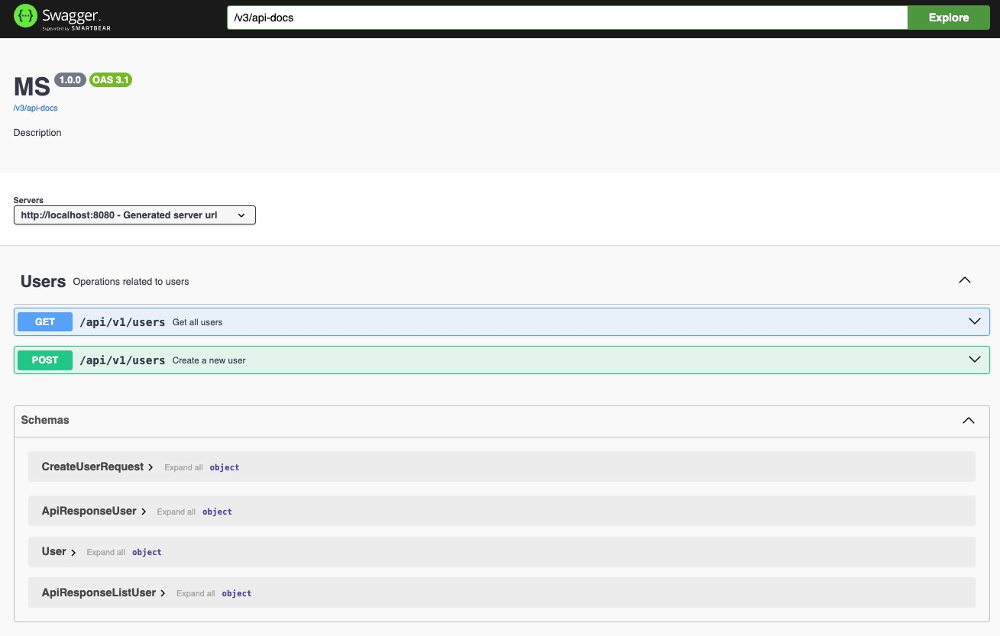

# Spring Boot Clean Architecture Template

A ready-to-use Spring Boot template following Clean Architecture principles. This template provides a structured
foundation for your Java projects with clear separation of concerns.

## Tech Stack

- 
- 
- 
- 
- 

## Project Structure



## Prerequisites

- Docker installed on your machine

## Getting Started

1. Clone this repository:
   ```bash
   git clone https://github.com/your-username/springboot-clean-architecture-template.git
    ```
2. Navigate to the project directory:
   ```bash
   cd springboot-clean-architecture-template
   ```
3. Copy the environment configuration file:
   ```bash
   cp .env.example .env
   ```

   You can now edit the .env file with your custom configuration (e.g., database credentials, port, JWT secret).

4. Build and run the application using Make commands:
   ```bash
   make build
   ```
5. Access the application at `http://localhost:8080`.

## Makefile Commands

- `make build`: Build the application.
- `make start`: Start the application.
- `make down`: Stop the application.
- `make clean`: Stop and remove containers, networks, volumes, and orphaned containers.
- `make help`: Display help information for available commands.

## OpenAPI Documentation

- The OpenAPI documentation is available at `http://localhost:8080/api/docs`.
- 

## Author

- [@jorge-andrade00](https://github.com/Jorge-Andrade00)